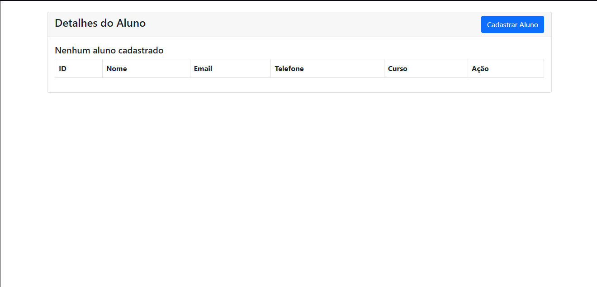
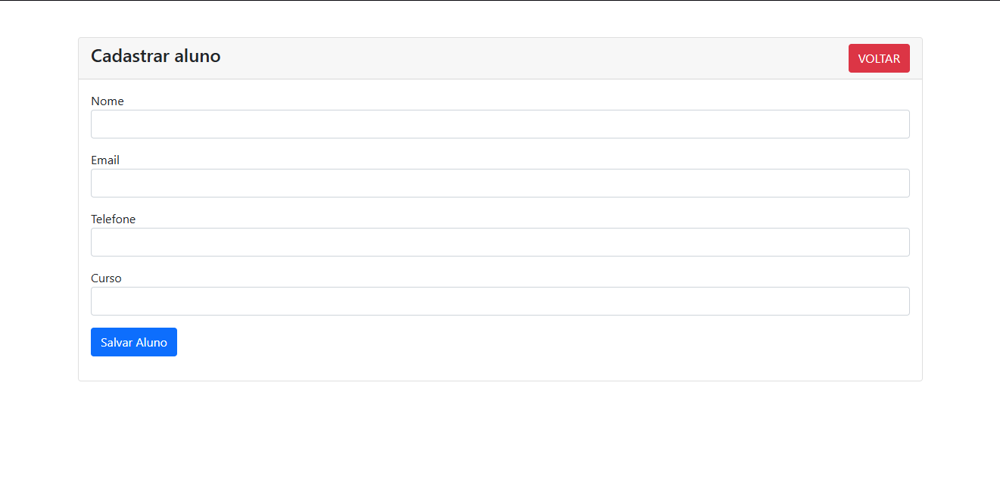
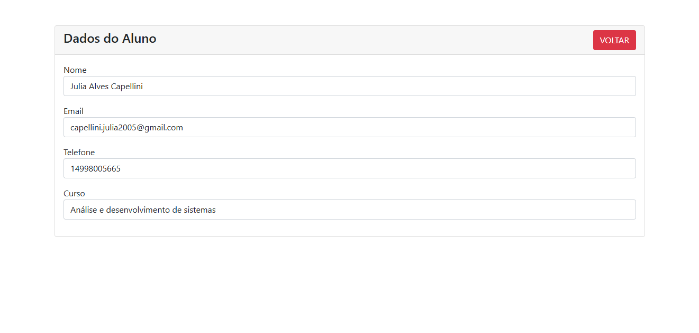
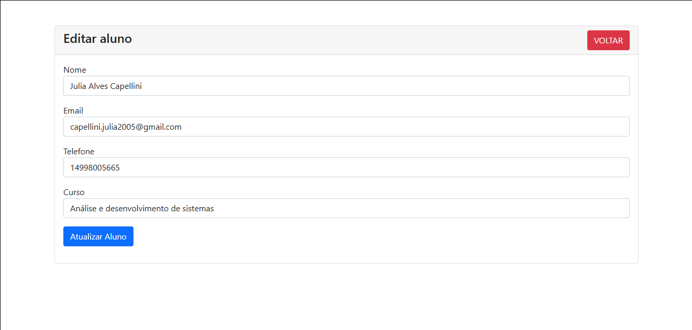
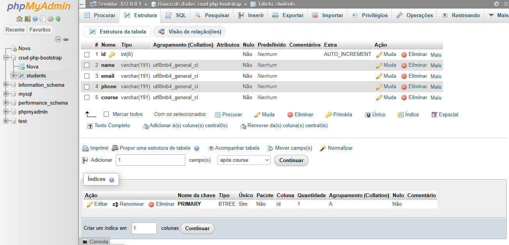

# Sistema de Cadastro de Alunos

Nesse projeto, foi criado um sistema CRUD de cadastro de alunos. O cadastro contém o ID do aluno, nome, e-mail, telefone e curso. Segue link de vídeo do sistema funcionando: https://vimeo.com/1083373605/ff9c701dc1?share=copy 

# Recursos utilizados

- PHP
- MySQL
- Bootstrap

# Views

1. **Tela Principal - index.php**  
Quando acessar o sistema, será demonstrada uma lista com os alunos cadastrados no banco de dados. 

2. **Formulário de cadastro - student-create.php**  
Ao clicar em "Cadastrar aluno" na tela principal, será enviado para o fomulário de cadastro de alunos.

3. **Visualizar cadastro - student-view.php**  
Para acessar essa página, clique em **Visualizar**. 

4. **Editar cadastro - student-edit.php**  
É possível editar o cadastro, clicando no botão **Editar**. 

5. **Estrutura do banco de dados**  
Segue informações caso queira replicar o banco:  
CREATE TABLE phpmyadmin.students (  
   id INT(6) NOT NULL AUTO_INCREMENT,  
   name VARCHAR(191) NOT NULL,  
   email VARCHAR(191) NOT NULL,  
   phone VARCHAR(191) NOT NULL,  
   course VARCHAR(191) NOT NULL,  
  PRIMARY KEY (id));  
  
